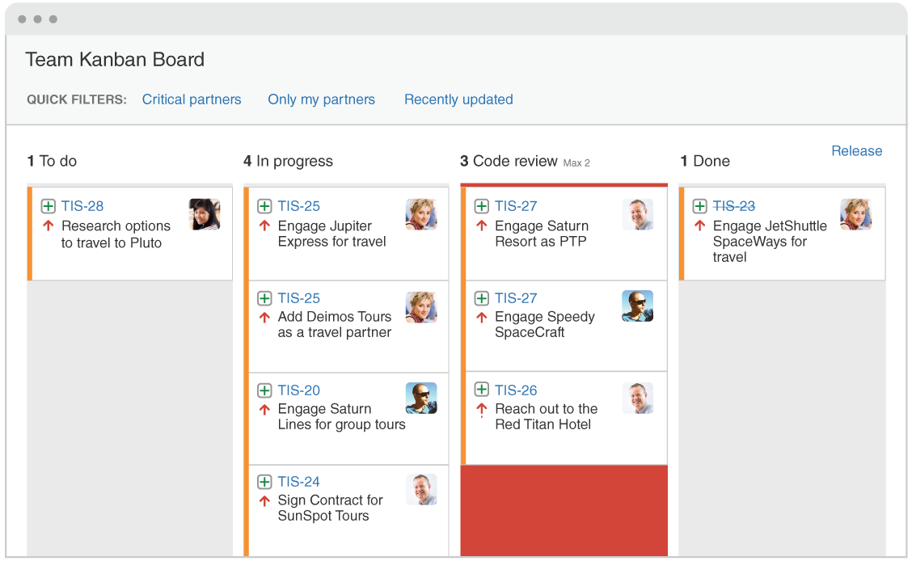
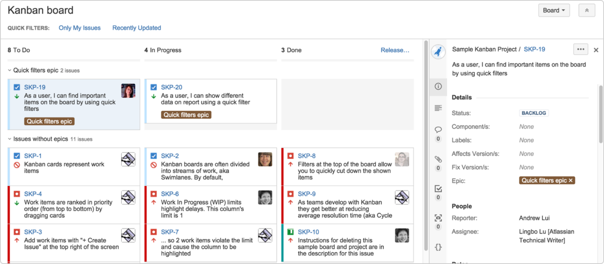

# Kanban
Second Wave Task for FE

Kanban board

Задание: Создать приложение Kanban Board

HTML/CSS	-	JS
Создать страницы:
1.	Домашняя страница
2.	Страница с выбранной доской
3.	Страница настройки выбранной доски
4.	Страница добавления задачи на выбранную доску

Домашняя страница/home page:
1. Отображает список созданных досок (название доски, дата создания, дата последнего редактирования(последнего действия на доске, с доской), настройки для каждой доски, удаление выбранной доски)
1.1. Список отображается по порядку начиная с последней редактируемой доски
1.2. Название каждой доски – ссылка на саму доску
1.3. Настройка для каждой доски – ссылка на страницу настройки доски
1.4. Клик на кнопку удаления выбранной доски удаляет ее

2. Показывает кнопку/ссылку на создание задачи на доску 
2.1.  Кнопка не активна если досок нет.
2.2. По клику переход на страницу создания задачи

3. Показывает кнопку создания новой доски
3.1. По клику появляется всплывающее окно
3.1.1. Содержит поле ввода имени новой доски (валидация: не меньше 3х символов, только буквы, имя уникально)
3.1.2. Содержит кнопку “создать”. Переходит на страницу созданной доски

Страница доски/board:

1. Название доски, соответствует значению, введенному в поле ввода на момент ее создания

2. фильтры
2.1. Содержит список фильтров для каждой доски. 
2.1.1. Клик по фильтру подсвечивает выбранный и фильтрует содержимое доски
2.1.2. Работа фильтра: фильтры работают независимо друг от друга (несколько фильтров могут быть активны в один момент времени). Если результаты выборок фильтров взаимоисключающие, то ничего отображаться не будет

3. Доска:
3.1. Только что созданная доска содержит 3 колонки и 0 элементов.
3.1.1. Колонки: TO DO (задачи, которые нужно сделать) In progress (задачи над которыми работают) Done (выполненные задачи)
3.1.2. Каждая колонка содержит информацию о количестве задач в ней

3.2. Задачи группируются на строки (rows) каждая строка соответствует задачам, которые выполняются, будут выполняться или завершены одним и тем же человеком.
3.2.1. Каждая строка содержит в себе информацию о человеке, задачи которого в ней отображаются (Имя и фамилия)
3.2.2. Каждая строка содержит в себе информацию об общем количестве задач в строке
3.2.3. Строка может содержать не более 5 задач в каждой ячейке, если это правило нарушается, то ничего не происходит ячейка становится недоступной)

3.3. Каждая задача содержит в себе информацию
3.3.1. Идентификатор задачи (ссылка, клик на которой открывает слева меню для редактирования задач) /тип задачи (тип это иконка и левая часть идентификатора т.е. ее префикс)
3.3.2. Название задачи
3.3.3. Приоритет задачи (вертикальная полоса слева (красный – высокий приоритет, оранжевый – средний приоритет, зеленый – низкий приоритет))
3.3.4. Метки/label
3.3.5. Иконку человека, который работает над этой задачей
3.3.6. Информацию о смене статуса задачи (стрелочка вверх, вниз показывает, что у задачи был изменен статус с менее/более приоритетного на текущий выбранный)
3.3.7. Каждая задача может быть переведена в любую колонку на доске через drag and drop (при этом статус задачи меняется на тот куда задача была переведена, работает только в пределе одной строки) + см. валидацию 3.2.3.
3.3.8. При клике на идентификатор задачи открывается меню редактирования задачи (появляется справа от доски и содержит следующие пункты)

3.3.8.1. Кнопку закрыть, которая закрывает меню редактирования и обновляет информацию на доске в соответствии с проделанными изменениями.
3.3.8.2. Идентификатор – текстовое поле
3.3.8.3. Название задачи – текстовое поле. При клике на него, заменяется на редактируемое поле, потеря фокуса на котором или Enter сохранит все внесенные изменения и вернет его к виду текстового поля.
3.3.8.3.1. Ограничение по количеству символов. 100
3.3.8.3.2. Пустое поле возвращает к изначальному значению до редактирования.
3.3.8.4. Описание задачи - работает как см.3.3.8.3.
3.3.8.4.1. Ограничение по количеству символов 1000
3.3.8.5. Приоритет – dropdown позволяющий выбрать один из трех приоритетов: высокий, средний, низкий
3.3.8.6. Метки (см. изображение в поле Epic) содержит список о всех присвоенных метках
3.3.8.6.1. нажатие на крестик удалит выбранную метку
3.3.8.6.2. содержит кнопку добавить, нажатие по которой отобразит поле ввода с фокусом на нем. Снятие фокуса сохранит все введенное и добавит к списку существующих меток
3.3.8.6.2.1. валидация: во всех случаях некорректной валидации не добавляет новую метку. Пустое значение, длина больше 10 символов, метка уникальна. Если поле не валидно, пользователю показывается предупреждение, что введенные данные были не валидны и прогресс потерян. Сообщение можно закрывать или оно само исчезнет через 5 секунд
3.3.8.7. Информация о человеке, который выполняет эту задачу - поведение как в 3.3.8.3.
3.3.8.8. Информация о текущем статусе задачи.
3.3.8.8.1. Dropdown содержащий в себе все колонки, отображаемые на текущей доске.

Страница настройки выбранной доски/ settings
1.Содержит в себе информацию о названии доски – редактируемое поле как в 3.3.8.3

2.Показывает список колонок на доске (изначально их 3) 
2.1. Кнопка добавить колонку 
2.1.1. По клику появляется текстовое поле, в которое вводится название новой колонки.
2.1.2. Валидация: Не меньше 3х и не больше 25 символов. Колонки с таким же названием не существует для текущей доски
2.1.3. По нажатию на Enter или при потере фокуса новая колонка добавляется в список колонок текущей доски.
2.1.4. Если валидация не проходится, то появляется сообщение о потерянном прогрессе, с возможностью закрыть его или оно само исчезнет через 5с.
2.2. Колонки можно менять местами, тем самым указывая нужный порядок их отображения на странице доски drag and drop. Порядок отображения колонок в этом списке регулирует их порядок для отображения на странице с доской

3. Показывает список текущих фильтров.
3.1. Изначально имеет один фильтр – задачи для стандартного работника (если у задачи не указан человек, который будет над ней работать)
3.2. Кнопка добавить фильтр 
3.2.1. По клику появляется dropdown с выбором всех доступных полей для задач. Справа от него отображается либо dropdown с доступными значениями, либо текстовое поле для ввода значения по которому будет осуществляться фильтрация. Пример: выбираем из первого dropdown поле приоритет. Справа будет отображаться еще один dropdown содержащий в себе все типы приоритетов (высокий/средний/низкий). Если выбрать значение название, то справа отобразится текстовое поле с возможностью ввести любой текст. 
3.2.2. Фильтрация по значениям из списка выполняется по полному совпадению
3.2.3. Фильтрация по значениям, введенным в текстовом поле осуществляется по наличию введенного значения в указанном параметре.
3.2.4. Создание фильтра содержит текстовое поле для имени этого фильтра.
3.3. Любой фильтр можно удалить

Страница добавления задачи на выбранную доску/newtask
1.Содержит в себе следующие поля
1.1. Название – текстовое поле
1.2. Описание – текстовое поле
1.3. Приоритет – dropdown
1.4. Метки – текстовое поле с возможностью добавить несколько меток
1.5. Работник: текстовое поле – не обязательное (без указания работника считается, что над задачей будет работать стандартный работник)
1.6. Тип задачи - dropdown содержит возможные типы задачи: фича, дефект ....
1.6.1. Каждый тип имеет свою иконку для отображения на доске
1.6.2.Каждый тип добавляет к идентификатору задачи свой префикс (фича feature-ID, дефект defect-ID)
1.7.Список досок - dropdown который определяет для какой доски создана задача
1.8. Кнопка создать, которая в случае успешной валидации переводит на страницу с доской, для которой данная задача была создана
1.9. В случае невалидного заполнения показывается уведомления о том, какие поля были заполнены некорректно. Повторное нажатие на кнопку проверит введенные данные и подсветит невалидные поля в случае если они есть.

Общие правила.
Если не указан тип валидации, то проверяется, что заполненное поле не пустое.
В случае если поле заполнено не валидно, то появляется уведомление о том, какое поле было заполнено не корректно и что его значение было возвращено к изначальному. Данное сообщение можно закрыть или оно исчезнет само через 5с. Само редактируемое поле становится текстовым.

Роутинг:
/ - домашняя страница
/newtask страница создания задачи
/board/:board_id страница выбранной доски
/board/:board_id/settings страница настройки доски

В случае противоположных или взаимоисключающих требований привести их к логически правильным.
